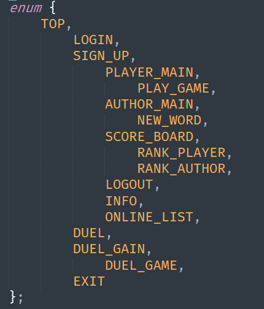
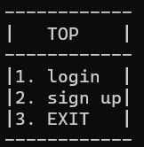

# 综合实验报告——猜词游戏

## 总体设计


### 前后端分离架构

​		整体使用host-terminal架构，即用户使用一个终端程序连接到服务器，由服务器承担运算，并向终端发送显示内容或取回输入。


### 网络通信设计

​		仿照HTTP协议，主机向终端发送request而终端回复response以此契合socket通信一发一收的要求，定义五种原语：

- CLEAR 令终端清屏，返回OK

- SHOW 下一条是需要显示的字符串，返回OK

- GET 从终端读取一条标准输入字符串，返回该字符串

- LAG 测试终端的网络延迟，返回OK

- END 告知终端停止运行，返回OK

  将一收一发封装进函数trans，简化网络通信。
  
  

### 服务端多并发设计

​		启动一个控制台线程，处理服务端输入的指令。

​		启动一个监听socket，对每个接入请求建立一个线程。此时使用map对线程号映射到连续的整数上，以此作为线程的标识，在其他功能中多使用 *fd*存储，为每个线程分配如下资源：

1. lag	存储链接的延迟

2. playerSortTag 存储玩家排行榜的排序偏好

3. authorSortTag 存储作者排行榜的排序偏好

4. sockList 存储该线程对应会话的套接字句柄

5. layer 存储该线程对应会话的当前界面号

6. curUser 存储该线程对应会话登录的用户信息

   之后进入会话处理函数：process_main。

​		为了防止quizList、userList与挑战相关这些公共资源使用冲突，设置三个互锁变量：

```C++
pthread_mutex_t userInfoLock;
pthread_mutex_t wordBaseLock;
pthread_mutex_t challengeLock;
```


### 用户UI架构设计

​		将用户UI划分为数个界面，诸如：登录页面、注册页面、排行榜页面等，具体划分如下：



​		使用enum为每一个层级分配了一个唯一编号。

​		链接刚建立时，用户都处于TOP页面：

​				



​		可见login和signup是top的下层菜单。

​		每个界面都会处理用户的一定操作，依据操作判断是否返回上级界面，或者进入其他下级界面，之后返回。

​		会话处理函数如下：

```c++
void *process_main(void *arg){
	lagTest();
	int fd = thread2int[pthread_self()];
	while(1){
		cout << layer[fd]<<" "<<fd << "\n";
		if(exitFlag.load()){//检测到全局退出信号，结束所有进程
			layer[fd] = EXIT;
		}
		if(duelRequest[fd] != 0 && layer[fd] != DUEL_GAME && layer[fd] != DUEL_GAME && layer[fd] != DUEL_GAIN){
			layerBackup[fd] = layer[fd];
			layer[fd] = DUEL_GAIN;
		}
		switch(layer[fd]){
			case TOP: 			process_top();			break;
			case LOGIN:			process_login();		break;
			case SIGN_UP:		process_sign_up();		break;
			case PLAYER_MAIN:	process_player_main();	break;
			case AUTHOR_MAIN:	process_author_main();	break;
			case SCORE_BOARD:	process_score_board();	break;
			case RANK_PLAYER:	process_rank_player();	break;
			case RANK_AUTHOR:	process_rank_author();	break;
			case INFO:			process_info();			break;
			case PLAY_GAME:		process_play_game();	break;
			case NEW_WORD:		process_new_word();		break;
			case ONLINE_LIST:	process_online_list();	break;
			case DUEL: 			process_duel();			break;
			case DUEL_GAIN:		process_duel_gain();	break;
			case DUEL_GAME:		process_duel_game();	break;
			case EXIT:			process_exit();			return nullptr;
		}
	}
}
```


​		可见，这是一个循环：处理层级——操作——变换层级

​		每个层级有对应的处理函数，用以给对应的用户展示UI和获取操作，以TOP层为例：
```C++
void process_top(){
	int fd = thread2int[pthread_self()];
	int networkState;
	//显示
	networkState = trans('c');
	if(networkState < 0){
		layer[fd] = EXIT;
		return;
	}
	string screen = "------------\n|   TOP    |\n------------\n|1. login  |\n|2. sign up|\n|3. EXIT   |\n------------\n";
	networkState = trans('s', screen);
	if(networkState < 0){
		layer[fd] = EXIT;
		return;
	}
	//输入
	string op;
	networkState = trans('g', op);
	if(networkState < 0){
		layer[fd] = EXIT;
		return;
	}
	switch(op[0]){
		case '1': layer[fd] = LOGIN; return;
		case '2': layer[fd] = SIGN_UP; return;
		case '3': layer[fd] = EXIT; return;
		default: 
			screen = "Unexpected input\n";
			networkState = trans('s', screen);
			if(networkState < 0){
				layer[fd] = EXIT;
				return;
			}
			Sleep(1000);
			return;
	}
}
```

​		可以看到，这个处理函数先发出了一个CLEAR，要求终端清屏，随后发出SHOW，将界面显示在终端上，再使用GET获取用户的操作。

​		在获取到操作op后，通过输入的标号，将该会话对应的layer设为用户选择的下一界面并返回，在process_main的下一循环中即可进入。

​		而输入非法时，使用SHOW提示用户输入不规范，不改变层级并返回，这使得下一轮循环中用户仍处于这个界面，而操作被清空。

​		*可以注意到在每一个tans调用后，都会获取它的返回值并判断是否进入EXIT层级，这是因为如果终端自行断开链接，会导致这一次页面处理无法正常完成，进而卡死服务端，这段代码用于在用户自行关闭后，转入EXIT页面，释放会话资源并保证服务端正常运行。*

​		其他层级的处理类似，但对不同的资源进行操作。


### 游戏中的数据结构设计


#### 用户(User)

​		用户的信息诸如等级、用户名、密码等，需要存储在服务器端。

```c++
class User{
protected:
	string name;
	string pwd;
	int level;
	virtual void levelUp() = 0;
public:
	virtual int getUserType() = 0;
	bool login(string);
	string getName();
	string getPwd();
	int getLevel();
	User(string, string, int);
};
```

##### 成员说明

- name 用户名
- pwd 密码
- level 等级

##### 成员函数说明

- User 构造函数。

- levelUp 虚函数，检测用户是否满足升级条件并更新等级。
- getUserType 虚函数，判断这个用户是玩家还是作者。
- login 判断输入的密码是否和这个用户匹配。
- getName 获取用户名。
- getPwd 获取用户密码。
- getLevel 获取用户等级。


#### 玩家(Player)

​		继承自用户类，玩家是玩游戏的用户，拥有经验值，关卡号等额外属性。

```c++
class Player: public User{
private:
	int levelDiv[11] = {0, 0, 10, 20, 30, 50, 100, 200, 500, 700, 1000};
	int expr;
	int passedCourse;
	void levelUp();
public:
	Player(string, string, int, int, int);
	void gainExp(int);
	int getExp();
	int getPassedCourse();
	int getUserType();
	void courseComplete();
};
```

##### 成员说明

- levelDiv 升级所需要的经验值。
- expr 经验值。
- passedCourse 已通过的关卡号

##### 成员函数说明

- Player 构造函数。
- levelUp 重载User中的虚函数，依据玩家的经验和升级表判断是否升级。
- gainExp 玩家获取一定值的exp，随后触发升级检测levelUp。
- getExp 获取玩家的经验值。
- getPassedCourse 获取玩家通关的关卡数
- getUserType 重载User中虚函数，返回常量TYPE_PLAYER。
- courseComplete 玩家完成一个关卡, passedCourse自增。


#### 作者(Author)

​		继承自用户类，作者是出题者，拥有出题数这一额外属性。

```c++
class Author: public User{
private:
	int levelDiv[11] = {0, 0, 1, 2, 3, 5, 10, 20, 50, 70, 100};
	int quizNum;
	void levelUp();
public:
	Author(string, string, int, int);
	int getQuizNum();
	int getUserType();
	void quizEstablished();
};
```

##### 成员说明

- levelDiv 升级需要的出题数表。
- quizNum 已出题数。

##### 成员函数说明

- Author 构造函数。
- levelUp 重载User的虚函数，依据出题数和升级表判断是否升级。
- getQuizNum 获取出题数
- getUserType 重载User的虚函数，返回常量TYPE_AUTHOR
- quizEstablished 成功发布一道题，quizNum自增，检查是否升级。


#### 单词(谜题)

​		这个游戏是让用户去记忆词语，并默写出来。在游戏中，问题的最小单位是一个词。定义单词(谜题)的类如下：

```c++
class Quiz{
private:
	string word;
	int diff;
public:
	Quiz(string, int);
	int getDiff();
	string getWord();
	bool check(string);
};
```

##### 成员说明

- word 存储单词的成员。
- diff 这个单词的难度。

##### 成员函数说明

- Quiz 构造函数，要求给定一个字符串与这个词的难度。
- getDiff 获取这个词的难度。
- getWord 获取这个词的字符串
- check 输入一个字符串，检查是否与对象内存储的字符串匹配。


#### 关卡

​		一次游戏中会出现多个单词，同时涉及根据答题时间计算经验获取等功能，因此关卡的对象如下：

```c++
class Course{
private:
	int round;
	int index;
	int courseNum;

public:
	vector<Quiz> quizList;
	Course(int,vector<Quiz>&);
	Course();
	Course(const Course&);
	int calcExp(int);
	Quiz *getQuiz();
	int getCourseNum() const;
	int getIndex() const;
	int getRound() const;
};
```

##### 成员说明

- round 这个关卡一共要答出多少单词。
- index 这个关卡当前进行到哪个单词。
- courseNum 这个关卡的关卡号。
- quizList 这个关卡内的谜题列表。

##### 成员函数说明

- Course 构造函数，支持从某词库中，依据关卡号自动建立谜题列表。
- Course 拷贝函数，深拷贝另一个Course对象。
- calcExp 根据用户的答题时间，计算在这一题上用户获得的经验。
- getQuiz 获取当前用户需要回答的题，同时使index自增。
- getCourseNum 获取关卡号。
- getIndex 获取当前问题的序号
- getRound 获取总问题数


## 各种需求的解决方案

​		下面陈述对实验中各项需求的解决方案


### 用户信息和词库离线存储

​		对这两组数据分布设了存储和读取函数，使用自定文件格式存储。

```c++
int stoUser(vector<User *>&, string);
int loadUser(vector<User *>&, string);
int stoQuiz(vector<Quiz>&, string);
int loadQuiz(vector<Quiz>&, string);
```

​		

### 难度基于关卡数动态变化

​		在生成关卡时，基于关卡数对选词和选词做了约束：

```c++
Course::Course(int courseNum, vector<Quiz> &fullQuiz){
	this->courseNum = courseNum;
	this->round = courseNum / 10 + 1;
	this->index = 0;
	int diff = courseNum / 5 + 3;
	vector<Quiz> limitedQuiz;
	for(int i = 0; i < (int)fullQuiz.size(); i++){
		if(fullQuiz[i].getDiff() == diff){
			limitedQuiz.push_back(fullQuiz[i]);
		}
	}
	//随机排序
	for(int i = limitedQuiz.size(); i > 0; i--){
		srand(unsigned(time(NULL)));
		int index = rand() % i;
		this->quizList.push_back(limitedQuiz[index]);
		limitedQuiz.erase(limitedQuiz.begin() + index);
	}
}
```

​		选词长度和数量都依据关卡数递增。


### 制定升级策略

​		在Player和Author的类中写死了升级表


### 根据难度调整经验获取

​		在计算经验时，引入了关卡难度与答题时间：

```c++
int Course::calcExp(int time){
	float rate = 4 / (time + 2);
	int basicExp = pow(this->courseNum, 2);
	int finalExp = (basicExp * rate);
	return finalExp;
}
```

​		最终的经验获取为：
$$
\frac{4*course^2}{time+2}
$$


### 排行榜排序

​		使用sort函数时，其cmp函数会依据用户所选定的排序标签进行比较，以此呈现出不同的排序结果。


### 基于实验二的基础上增加网络连接、多并发功能

​		为了便于会话间的相互交互，将运算统一交给服务端处理，客户端只有链接和显示、输入功能。


### 查看在线用户

​		遍历线程映射表，在curUser中对照有无用户信息后显示即可。


### 联机对战功能

​		在挑战者发起挑战后，缓存当前界面号并转入挑战等待界面阻塞，创建一个条件变量等待被挑战者唤醒。被挑战者在处理完当前界面后，检测到挑战列表中有新的挑战，那么缓存当前界面号并进入应战界面。

​		若被挑战者选择接受，则唤起挑战者，生成谜题后复制一份给挑战者，两人进入对战界面；若不接受，唤起挑战者，两者回到先前的界面。

​		进入对战界面后，两人分别建立两道互斥锁，分别在显示词语以及判断胜负前阻塞，只有两人同时准备好后才开始答题，在两人都答完后互相发送传递时间，分别判断胜负。胜者获得1.5倍经验，负者不获得经验。如此循环直到关卡通过。

​		通过后，显示结算界面，提示每个用户获取的经验和获胜题数，之后分别返回原先界面。


## 可能的改进方向

- 每次网络通信候检查socket状态显得程序过于臃肿， 可以在网络异常时控制线程直接结束。

- 在这一UI框架上增加更多新用户功能
- 改进通信函数，使之可以传送quiz和user等信息，将运算交给用户完成


## 收获与经验总结

​		第一次使用socket进行网络编程，在查资料之后初步掌握了socket的使用方法。在最初使用时，由于不理解socket的底层机制，即收数据是从传输层缓存全部拷贝，导致没有让send和recv一对一，以至于通信故障。在开发对战功能时，尝试了信号量、条件变量多种方法，最后使用互斥锁：释放自身随后互相等待达成同步。这次综合实验让我对面向对象编程、网络编程和多并发编程有了更直观的体会，过程很有趣，收获良多。
